### CONVERSOR DE MONEDA Auditoria de sistemas  💻💻

El motivo de este trabajo de la materia de **AUDITORÍA**  de sistemas de información es  mostrar un pequeño ciclo devops utilizando herramientas como  tello, sonarcloud, travis -ci, heroku, entre otras herramientas , para el cual Nosotros decidimos hacer un pequeño programa que lo que hiciera este fuera hacer la conversion de monedas del mundo  en tiempo real, consumiendo una API, la cual pueden consultar [aqui.](http://https://app.exchangerate-api.com "aqui.")

- Dentro de nuestro proyecto van a encontrar  4 branch las cuales son  master,develop, false  y main. La rama principal del proyecto que se desplegó es la rama master.
Dentro de la rama master van a poder encontrar  los siguientes archivos:

- .github/workflows

- conversor

- img

- .gitignore

- .travis.yml

- conversion.php

- index.php

- result.jsp

- script.js

- sonar-project.properties

- style.css

* test.php


.github/workflows
=============
Dentro de este archo vas a poder encontrar el **build.yml** que contiene lo siguiente:
```yaml
name: Build
on:
  push:
    branches:
      - master
  pull_request:
    types: [opened, synchronize, reopened]
jobs:
  sonarcloud:
    name: SonarCloud
    runs-on: ubuntu-latest
    steps:
      - uses: actions/checkout@v3
        with:
          fetch-depth: 0  # Shallow clones should be disabled for a better relevancy of analysis
      - name: SonarCloud Scan
        uses: SonarSource/sonarcloud-github-action@master
        env:
          GITHUB_TOKEN: ${{ secrets.GITHUB_TOKEN }}  # Needed to get PR information, if any
          SONAR_TOKEN: ${{ secrets.SONAR_TOKEN }}
```
lo que  significa lo siguiente:
**name**: Define el nombre de este flujo de trabajo. En este caso, se llama "Build".

**on**: Especifica cuándo se activará este flujo de trabajo. En este caso, se activará cuando se haga un push a la rama master o cuando se abra, sincronice o reabra un pull request.

**jobs**: Contiene uno o más trabajos que se ejecutarán como parte de este flujo de trabajo.

**sonarcloud**: Este es el nombre del trabajo. En este caso, el trabajo se llama "SonarCloud".

**name**: Nombre del trabajo. En este caso, es "SonarCloud".

**runs-on**: Especifica el sistema operativo en el que se ejecutará este trabajo. En este caso, se ejecutará en ubuntu-latest.

**step**s: Contiene una lista de pasos que se ejecutarán como parte de este trabajo.

**uses**: Especifica una acción que se utilizará en este paso. En este caso, se utiliza la acción checkout v3 para clonar el repositorio en el runner de GitHub Actions.

**with**: Permite configurar opciones para la acción. En este caso, se establece fetch-**depth:** 0 para deshabilitar clones superficiales, lo que mejora la relevancia del análisis.
**name:** Es el nombre del paso. En este caso, es "SonarCloud Scan".

**uses:** Otra acción que se utilizará en este paso. En este caso, se utiliza la acción SonarSource/sonarcloud-github-action master para realizar un análisis en SonarCloud.

**env: **Permite configurar variables de entorno para este paso. Aquí se proporcionan los tokens de GitHub y SonarCloud necesarios para el análisis.

En resumen, este archivo de configuración define un flujo de trabajo llamado "Build" que ejecutará un análisis en SonarCloud cada vez que se haga un push a la rama master o se abra, sincronice o reabra un pull request en el repositorio de GitHub.

 conversor
=============
en esta carpeta esta vacia.

 img
=============
En esta carpeta encontran el logo que esta en la pagina principal.

.gitignore
=============


 .travis.yml
=============
 eneste archivo encontraran el codigo que usamos para poder conectar travis-CI con github y contiene el siguiente codigo:
 ```yaml
language: php
php:
  - '7.3'
  
  # Instalar dependencias
  install:
    - composer install

dist: bionic


# Configurar el servidor Tomcat embebido
services:
  - docker
  - mysql
  - postgresql

before_script:
  -cp .env.example .env
  - mysql -e 'create database conversordb;'
  - composer self-update
  - composer install --no-interaction --prefer-source 
  - php artisan key:generate
  - php artisan migrate


# Compilar y ejecutar pruebas
script:
  - vendor/bin/phpunit
  

# Despliegue de la aplicación en Tomcat
after_success:
  - docker run -d --name tomcat-container -p 8080:8080 -v $TRAVIS_BUILD_DIR/src/main/webapp/:/usr/local/tomcat/webapps/ tomcat:latest

```

 conversion.php
=============
denro de este archivo podemos encontrar el codigo principal con el que se llama a la API para hacer la conversion de la moneda. el codigo de ello es el siguiente el cual  tambien explicaremos acontinuación:
```php
<?php


// Verificar si se han enviado datos desde el formulario
if ($_SERVER["REQUEST_METHOD"] == "POST") {
    // Obtener los datos enviados desde el formulario
    $moneda_origen = $_POST['moneda-uno'];
    $moneda_destino = $_POST['moneda-dos'];
    $cantidad_origen = $_POST['cantidad-uno'];

    // Construir la URL de la API con los parámetros necesarios
    $url = "https://v6.exchangerate-api.com/v6/6c000385a09765c6fbfa5911/latest/{$moneda_origen}";


    // Hacer la solicitud a la API y obtener la respuesta
    $response = file_get_contents($url);

        // Decodificar la respuesta JSON en un arreglo asociativo
    $data = json_decode($response, true);

    // Verificar si la solicitud fue exitosa
    if ($data && $data['result'] == 'success') {
        // Obtener la tasa de conversión de la moneda destino
        $tasa_conversion = $data['conversion_rates'][$moneda_destino];

        // Calcular el resultado de la conversión
        $resultado = $cantidad_origen * $tasa_conversion;

        // Mostrar el resultado
        echo "<p>{$cantidad_origen} {$moneda_origen} equivale a {$resultado} {$moneda_destino}</p>";
    } else {
        // Mostrar un mensaje de error si la solicitud falla
        echo "<p>Hubo un error al obtener la tasa de conversión.</p>";
    }
}
?>
```
- **Verificación del método de solicitud HTTP**: Primero, el código verifica si se ha enviado una solicitud HTTP mediante el método POST. Esto se hace con la condición if ($_SERVER["REQUEST_METHOD"] == "POST"). Esto asegura que el código dentro de este bloque se ejecute solo cuando se envía un formulario utilizando el método POST.

- **Obtención de datos del formulario**: Si se ha enviado una solicitud POST, el código procede a obtener los datos enviados desde el formulario. Estos datos incluyen la moneda de origen, la moneda de destino y la cantidad de la moneda de origen que se desea convertir. Se extraen estos datos del array $_POST.

- **Construcción de la URL de la API**: Luego, el código construye la URL de la API de conversión de moneda. Utiliza la moneda de origen proporcionada para formar esta URL. La URL incluye una clave de API única que permite acceder a los datos de conversión de moneda.

- **Solicitud a la API y obtención de la respuesta**: El código realiza una solicitud HTTP a la URL de la API utilizando la función file_get_contents(). Esta función recupera el contenido de un archivo remoto. En este caso, recupera los datos de conversión de moneda en formato JSON.

- ** Decodificación de la respuesta JSON**: Una vez que se recibe la respuesta JSON de la API, el código la decodifica en un array asociativo utilizando la función json_decode(). Esto convierte los datos JSON en un formato que PHP puede manipular fácilmente.

- **Verificación de la respuesta de la AP**I: El código verifica si la solicitud a la API fue exitosa. Esto se hace comprobando si el campo "result" en los datos decodificados es igual a "success".

- **Cálculo de la conversión**: Si la solicitud a la API fue exitosa, el código procede a calcular el resultado de la conversión. Utiliza la tasa de conversión obtenida de los datos decodificados y la cantidad de la moneda de origen para calcular la cantidad equivalente en la moneda de destino.

- **Mostrar el resultado**: Finalmente, el código muestra el resultado de la conversión al usuario. Lo hace imprimiendo un mensaje que indica la cantidad de moneda de origen, la moneda de origen, la cantidad equivalente en la moneda de destino y la moneda de destino.

- **Manejo de errores**: Si la solicitud a la API falla por alguna razón, el código muestra un mensaje de error indicando que hubo un problema al obtener la tasa de conversión.


index.php
=============
En este archivo encontras todo el codigo html de la pagina:

    <!DOCTYPE html>
    <html lang="en">
    <head>
        <meta charset="UTF-8">
        <meta http-equiv="X-UA-Compatible" content="IE=edge">
        <meta name="viewport" content="width=device-width, initial-scale=1.0">
        <link rel="stylesheet" href="style.css">
        <title>Conversor de Moneda</title>
    </head>
    <body>
        
        <h1>Conversor de Monedas</h1>
        <p>Escoge por favor la Moneda  y la cantidad para realizar la conversi&oacute;n que t&uacute; deseas.</p>
    
        <form  action="conversion.php" method="post">
            <input type="hidden" name="moneda-uno" id="hidden-moneda-uno">
            <input type="hidden" name="moneda-dos" id="hidden-moneda-dos">
            <input type="hidden" name="cantidad-uno" id="hidden-cantidad-uno">
            <input type="hidden" name="cantidad-dos" id="hidden-cantidad-dos">
    
          
    
        <div class="container">
            <div class="moneda">
                <select name="moneda-uno" id="moneda-uno">
    
                <option value="AED">AED</option>
                    <option value="ARS">ARS</option>
                    <option value="AUD">AUD</option>
                    <option value="BGN">BGN</option>
                    <option value="BRL">BRL</option>
                    <option value="BSD">BSD</option>
                    <option value="CAD">CAD</option>
                    <option value="CHF">CHF</option>
                    <option value="CLP">CLP</option>
                    <option value="CNY">CNY</option>
                    <option value="COP">COP</option>
                    <option value="CZK">CZK</option>
                    <option value="DKK">DKK</option>
                    <option value="DOP">DOP</option>
                    <option value="EGP">EGP</option>
                    <option value="EUR">EUR</option>
                    <option value="FJD">FJD</option>
                    <option value="GBP">GBP</option>
                    <option value="GTQ">GTQ</option>
                    <option value="HKD">HKD</option>
                    <option value="HRK">HRK</option>
                    <option value="HUF">HUF</option>
                    <option value="IDR">IDR</option>
                    <option value="ILS">ILS</option>
                    <option value="INR">INR</option>
                    <option value="ISK">ISK</option>
                    <option value="JPY">JPY</option>
                    <option value="KRW">KRW</option>
                    <option value="KZT">KZT</option>
                    <option value="MXN">MXN</option>
                    <option value="MYR">MYR</option>
                    <option value="NOK">NOK</option>
                    <option value="NZD">NZD</option>
                    <option value="PAB">PAB</option>
                    <option value="PEN">PEN</option>
                    <option value="PHP">PHP</option>
                    <option value="PKR">PKR</option>
                    <option value="PLN">PLN</option>
                    <option value="PYG">PYG</option>
                    <option value="RON">RON</option>
                    <option value="RUB">RUB</option>
                    <option value="SAR">SAR</option>
                    <option value="SEK">SEK</option>
                    <option value="SGD">SGD</option>
                    <option value="THB">THB</option>
                    <option value="TRY">TRY</option>
                    <option value="TWD">TWD</option>
                    <option value="UAH">UAH</option>
                    <option value="USD" selected>USD</option>
                    <option value="UYU">UYU</option>
                    <option value="VND">VND</option>
                    <option value="ZAR">ZAR</option>
                </select>
    
                <input 
                type="number" 
                id="cantidad-uno" 
                name="cantidad-uno"
                placeholder="0"  
                
                >
    
            </div>
    
            <div class="tasa-cambio-container">
                <button type="submit" class="btn" id="tasa">
                   Conversi&oacute;n 
                </button>
    
                <div class="cambio" id="cambio"></div>
    
            </div>
    
            <div class="moneda">
                <select name="moneda-dos" id="moneda-dos">
    
                <option value="AED">AED</option>
                    <option value="ARS">ARS</option>
                    <option value="AUD">AUD</option>
                    <option value="BGN">BGN</option>
                    <option value="BRL">BRL</option>
                    <option value="BSD">BSD</option>
                    <option value="CAD">CAD</option>
                    <option value="CHF">CHF</option>
                    <option value="CLP">CLP</option>
                    <option value="CNY">CNY</option>
                    <option value="COP">COP</option>
                    <option value="CZK">CZK</option>
                    <option value="DKK">DKK</option>
                    <option value="DOP">DOP</option>
                    <option value="EGP">EGP</option>
                    <option value="EUR" selected>EUR</option>
                    <option value="FJD">FJD</option>
                    <option value="GBP">GBP</option>
                    <option value="GTQ">GTQ</option>
                    <option value="HKD">HKD</option>
                    <option value="HRK">HRK</option>
                    <option value="HUF">HUF</option>
                    <option value="IDR">IDR</option>
                    <option value="ILS">ILS</option>
                    <option value="INR">INR</option>
                    <option value="ISK">ISK</option>
                    <option value="JPY">JPY</option>
                    <option value="KRW">KRW</option>
                    <option value="KZT">KZT</option>
                    <option value="MXN">MXN</option>
                    <option value="MYR">MYR</option>
                    <option value="NOK">NOK</option>
                    <option value="NZD">NZD</option>
                    <option value="PAB">PAB</option>
                    <option value="PEN">PEN</option>
                    <option value="PHP">PHP</option>
                    <option value="PKR">PKR</option>
                    <option value="PLN">PLN</option>
                    <option value="PYG">PYG</option>
                    <option value="RON">RON</option>
                    <option value="RUB">RUB</option>
                    <option value="SAR">SAR</option>
                    <option value="SEK">SEK</option>
                    <option value="SGD">SGD</option>
                    <option value="THB">THB</option>
                    <option value="TRY">TRY</option>
                    <option value="TWD">TWD</option>
                    <option value="UAH">UAH</option>
                    <option value="USD">USD</option>
                    <option value="UYU">UYU</option>
                    <option value="VND">VND</option>
                    <option value="ZAR">ZAR</option>
                </select>
    
                <input 
                type="number" 
                id="cantidad-dos" 
                name="cantidad-dos"
                placeholder="0"  >
    
            </div>
    
        </div>
    
      
        </form>
        <footer>
            <p>&copy; 2024 Mi Sitio Web - Todos los derechos reservados.</p>
            <p> Juan Camilo Ramirez Chaverra Y Juan Camilo Ramirez Hoyos</p>
        </footer>
       
    
    </body>
    </html>
    
DIAGRAMA DE FLUJO
=============
```markdown

```mermaid
graph LR
    A((Formulario HTML)) -->|Envío de datos| B((Servidor PHP))
    B -->|Solicitud a API| C((API de Conversión de Moneda))
    C -->|Respuesta JSON| B
    B -->|Respuesta de conversión| A
    style A fill:#f9f,stroke:#333,stroke-width:2px
    style B fill:#f9f,stroke:#333,stroke-width:2px
    style C fill:#f9f,stroke:#333,stroke-width:2px

```

DIAGRAMA
========
```markdown
sequenceDiagram
    participant User
    participant Formulario
    participant PHP_Script
    participant API
    participant Pagina_Web

    User->>Formulario: Accede al formulario
    User->>Formulario: Selecciona moneda y cantidad
    User->>Formulario: Presiona el botón de conversión
    Formulario->>PHP_Script: Envía datos para procesar
    PHP_Script->>API: Realiza solicitud de tasa de cambio
    API-->>PHP_Script: Devuelve la tasa de cambio
    PHP_Script-->>Pagina_Web: Calcula el resultado
    Pagina_Web-->>User: Muestra el resultado

```
TRELLO
======
